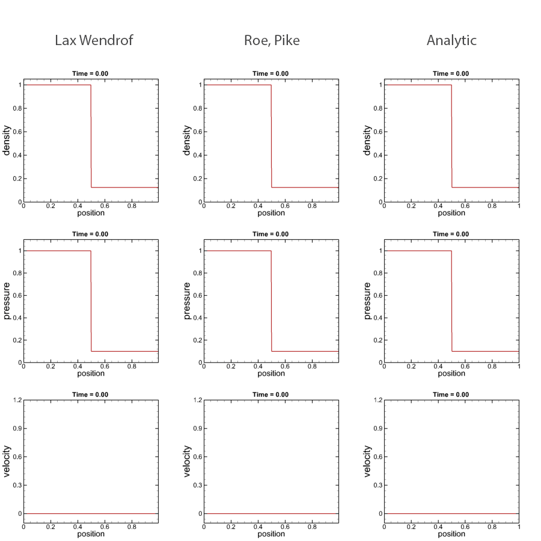

## GPU-accelerated simulation of Sod shock tube problem by NVIDA CUDA

The Sod shock tube is a Riemann problem used as a standard test problem in computational Fluid dynamics.
Checkout the article in [Wikipedia](http://en.wikipedia.org/wiki/Sod_shock_tube) for a more complete description of the Sod problem.
### About the code
In this project we use algorithms presented in Lax [1] and Roe [2] to solve the Sod shock tube problem using CUDA and we use the standard test case for the initial condition ([rho_left, P_left, v_left] = [1, 1, 0], [rho_right, P_right, v_right] = [0.125, 0.1, 0]) and the reatio of specific heats (1.4).
We compare the results with the anaylitical solution. Moreover, we will compare the run-time and memory cost of solution on cpu in C++ and solution on gpu in CUDA C++.

[1] P.D Lax and B. Wendroff (1960). “Systems of conservation laws”. Commun. Pure Appl. Math. 13 (2): 217–237. 
[2] P. Roe and J. Pike, (1984). “Efficient Construction and Utilisation of Approximate Riemann Solutions,” Comput. Methods Appl. Sci. Eng., no. INRIA North-Holland, pp. 499–518.

 

### To create the Analytic results (analytical.dat)
Run analyticalNumpy/exactRiemann.py by python.
For analytical results we used sod library from https://github.com/ibackus/sod-shocktube repository which is a simple pythonic implementation of a Riemann solver for the analytic solution of the sod shock tube.

### To create the Numerical results (lax.dat, roe.dat)
Build and run the solution of cudaShockTube/shockTube.sln in Visual Studio.

# Prerequisites
* A system with an NVIDIA GPU and CUDA-supporting drivers
* Visual Studio (for Numerical Solution)
* Python for Analytical Solution (for validation purpose)
* Tecplot 360 (past processing)
