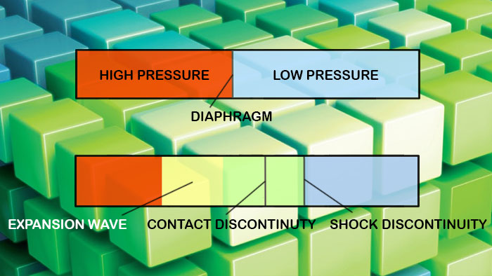

# SodShockTube
### Simulation of Sod shock tube problem, using C++,on CPU and NVIDIA CUDA, on GPU

  

The Sod shock tube problem, named after Gary A. Sod, is a common test for the accuracy of computational fluid codes, like Riemann solvers, and was heavily investigated by Sod in 1978. The test consists of a one-dimensional Riemann problem which its time evolution can be described by solving the Euler equations, which leads to three characteristics, describing the propagation speed of the various regions of the system. Namely the expansion wave, the contact discontinuity and the shock discontinuity. If this is solved numerically, one can test against the analytical solution, and get information how well a code captures and resolves shocks and contact discontinuities and reproduce the correct density profile of the expansion wave. 

In this project we numerically solve the Sod shock tube problem using CUDA and compare the results with the anaylitical solution. Moreover, we compare the run-time and memory cost of solution on cpu in C++ and solution on gpu in CUDA C++.

[1] P.D Lax and B. Wendroff (1960). “Systems of conservation laws”. Commun. Pure Appl. Math. 13 (2): 217–237. 
[2] P. Roe and J. Pike, (1984). “Efficient Construction and Utilisation of Approximate Riemann Solutions,” Comput. Methods Appl. Sci. Eng., no. INRIA North-Holland, pp. 499–518.

